# Parcial-CC3S2

## Rama: `feature-ravichagua-wordManager`

### Implementacion de la clase word_manager
Se implemento la clase `word_manger` para gestionar las palabras y pistas correspondientes a la dificultad desde un archivo de texto.  

+ Función `Constructor`:  
Se creó el constructor de la clase donde guardas informacion como el nombre del archivo a obtener la data y almacenar las palabras y pistas correspondientes.  

  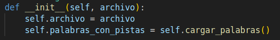
+ Función `cargar_palabras`:  
  En esta parte del codigo, se desarrollo la logica para obtener la data correspodiente a las palabras y respectivas pistas, finalmente devolvemos la data sin espacios y separadas por una `,` en una lista de comprension.  
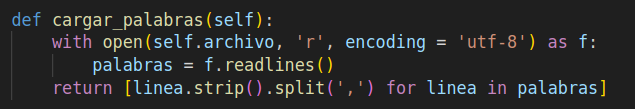

+ Función `seleccionar_todas_las_palabras`:  
Asi mismo, esta parte de codigo selecciona todas las palabras y pistas correspondientes, los mezcla en un orden aleatorio.  
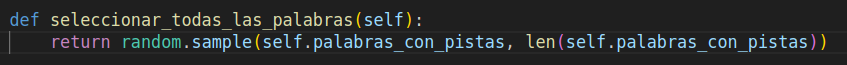

### Integracion de las Palabras
Se creo y implemento las palabras segun la dificultad elegida por el jugador 
con sus respectivas pistas de acuerdo al numero de intentos

- **Words Easy**  
Palabras comunes y faciles de adivinar, tales como:  
**`CASA`**  
`Pistas:`
  - Es un lugar donde vives.    
  - Tiene paredes y un techo.  
  - La mayoría de las personas duermen aquí.

- **Words Medium**  
Palabras no tan comunes pero aumenta la dificultad por la longitud.  
**`ESCUELA`**  
`Pistas:`  
  - Es un lugar de aprendizaje.  
  - Tiene aulas y maestros. 
  - Los estudiantes asisten aquí.

- **Words Hards**
Palabras raramente comunes, ademas de la complejidad de la longitud.  
**`UNIVERSIDAD`**  
`Pistas:`  
   - Es una institución educativa superior.  
   - Ofrece licenciaturas y posgrados.
   - Los estudiantes mayores asisten aquí.

## Rama: `feature/diego/infraestructura`

Esta rama contiene la implementación de la infraestructura necesaria para ejecutar el juego de ahorcado utilizando Docker, CI/CD con GitHub Actions, y monitoreo con Prometheus.

### 1. Docker Compose

**Archivo: `docker-compose.yml`**

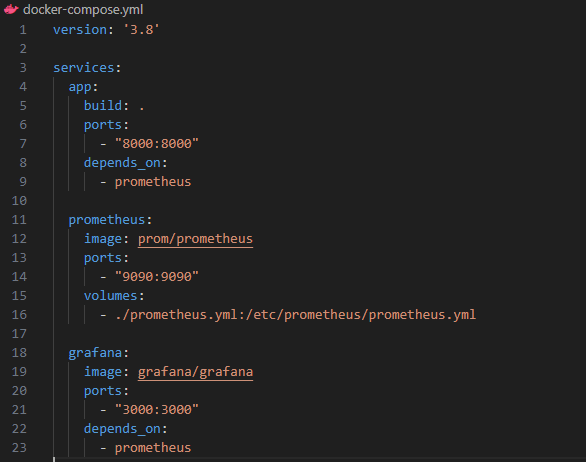

#### Descripción

- **Versión**: Se especifica la versión de Docker Compose a utilizar.
- **Servicios**:
  - **app**: Se construye a partir del `Dockerfile` en el directorio raíz del proyecto. Expone el puerto 8000 para que la aplicación de consola pueda ser accesible (esto será útil para el monitoreo).
  - **prometheus**: Se utiliza la imagen oficial de Prometheus. Se expone el puerto 9090 y se monta un archivo de configuración que define cómo debe recolectar las métricas.
  - **grafana**: Se utiliza la imagen oficial de Grafana y se expone el puerto 3000 para acceder a la interfaz de Grafana.

### 2. CI/CD (GitHub Actions)

**Archivo: `.github/workflows/ci.yml`**

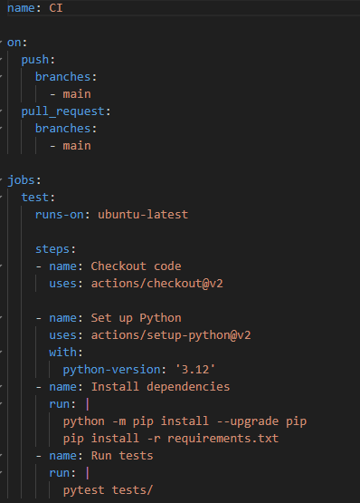

#### Descripción

- **Nombre del flujo de trabajo**: Se llama "CI".
- **Eventos**:
  - Se activa en `push` y `pull_request` en la rama principal (`main`).
- **Jobs**:
  - **test**: Se ejecuta en un entorno de Ubuntu y realiza las siguientes acciones:
    - Clona el repositorio.
    - Configura Python en la versión especificada.
    - Instala las dependencias desde `requirements.txt`.
    - Ejecuta los tests utilizando `pytest`.

### 3. Prometheus

**Archivo: `prometheus.yml`**

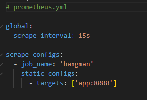

#### Descripción

- **Configuración Global**:
  - **scrape_interval**: Define cada cuánto tiempo Prometheus debe recolectar métricas (en este caso, cada 15 segundos).
- **Scrape Configurations**:
  - Se configura un trabajo llamado "hangman" que le dice a Prometheus que recolecte métricas del servicio `app` en el puerto especificado.
     
# Implementación de la clase Difficulty
La siguiente clase tiene un método `obtener_archivo_por_dificultad()`, el usuario al principio ingresa la dificultadad, entonces dependiendo de eso, el método devuelve el archivo txt correspondiente que tiene todas las palabras correspondientes a esa dificultad.  
  
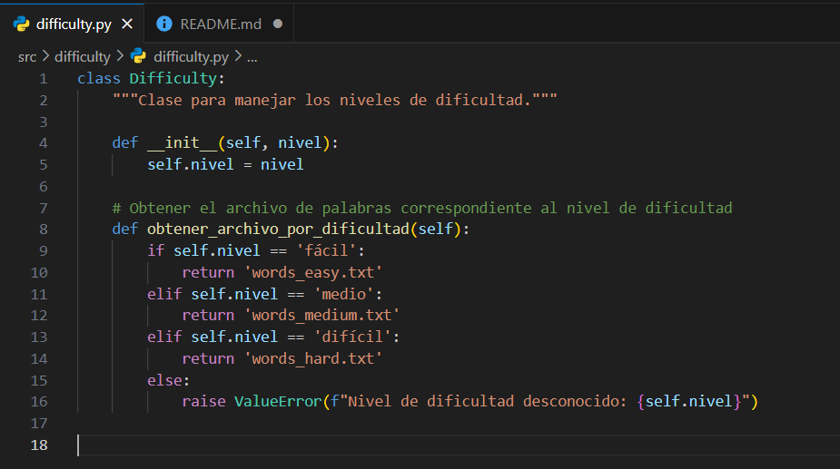  
  
# Implementación de la clase GameStates  
Esta clase tiene como objetivo gestionar el estado del juego controlando las letras que el jugador ha adivinado correctamente o incorrectamente, los intentos restantes (en un principio el jugador tiene 6 intentos para fallar), las pistas a mostrar y si el juego a terminado o no:  
  
+ Atributos:  

  `palabra`: almacena la palabra a adivinar  
  `pistas`: pistas asociadas a la palabra a adivinar(ver los txts)  
  `letras_adividadas`: Conjunto de las letras adivinadas correctamente  
  `letras_incorrectas`: Conjunto de las letras adivinadas incorrectamente  
  `intentos_restantes`: Intentos que tiene el jugador para fallar  
  `pistas_mostradas`: Número de pistas que se han mostrado  
  `ganado`: Variable booleana que indica si el jugador a adivinado toda la palabra completa  

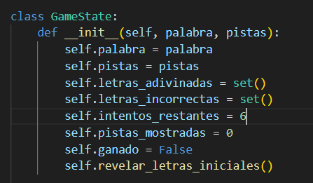  
    
+ Función `revelar_letras_iniciales()`:  

  Cuando el juego comienze, la palabra a adivianr no va a aparecer en blanco, es decir con letras vacías pues el jugador no tendría idea que palabra se trata, por eso se muestran unas cuantas palabras para que el jugagor pueda tener algo con que adivinar  

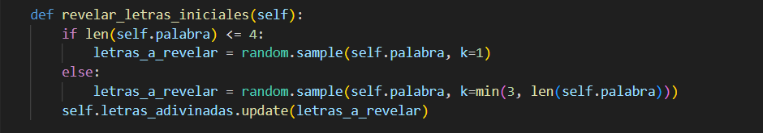  
  
+ Función `mostrar_estado()`:  
Aquí se devuelve el estado de la palabra, es decir se muestra que tanto a adivinado el jugador de la palabra, por ejemplo si la palabra es `PUERTA` y el jugador solo ha adivinado P,R,T entonces el estado de la palabra será P_ _ RT _.
  
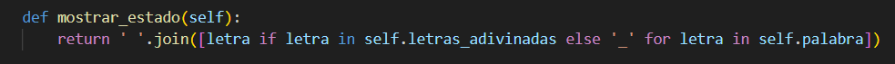  
  
    
+ Función `adivinar_letra()`:  
  Esta función responde a cada adivinanza que el jugador hace, si la letra ya ha sido adivina antes (correcta o incorrectamente) le da un respectivo mensaje. Pero si la letra es correcta es decir está en la palabra entonces se muestra un mensaje respectivo, sin embargo si no está en la palabra se muestra una pista y descontamos los intentos en 1.

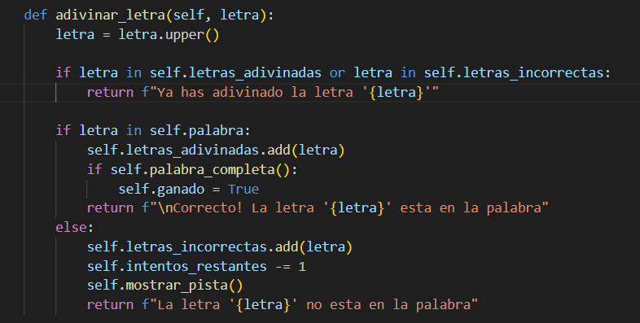  
    
+ Función `mostrar_pista()`:  
Esta función muestra la pista cada vez que el jugador ha fallado al momento de adivinar una palabra, además el numero de pistas mostradas se incremete para no repetir las mismas pistas  

  
  
+ Función `palabra_completa()`:  
Esta función verifica si el jugador ya ha adivinado todas las palabras, devolvéra True si eso es cierto, pero False si aun no ha terminado de adivinar toda la palabra   
  
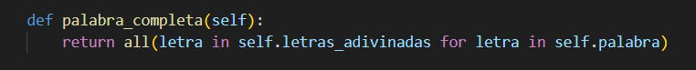
  
+ Función `juego_terminado()`:  
Esta función verifica si el juego ya ha terminado, esto es si el jugador ya ha ganado el juego o si su numero de intentos se han acabado  
  
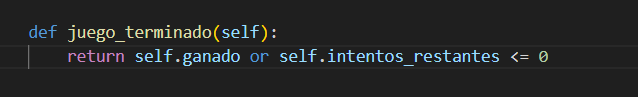
